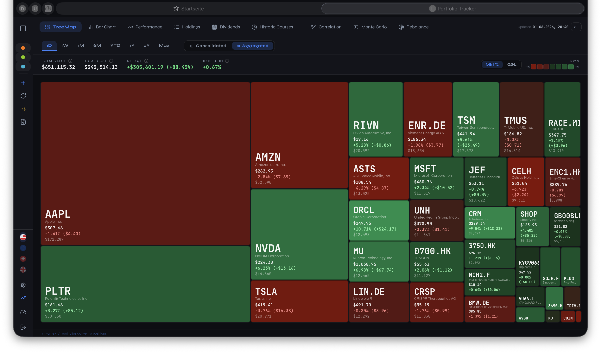
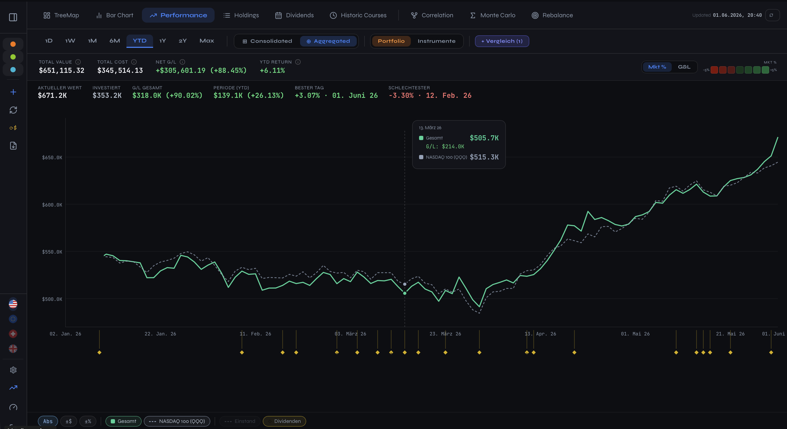
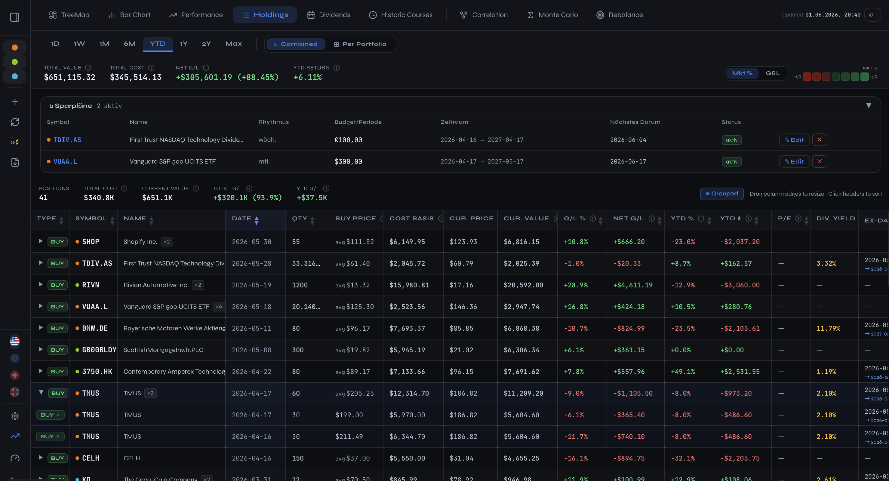
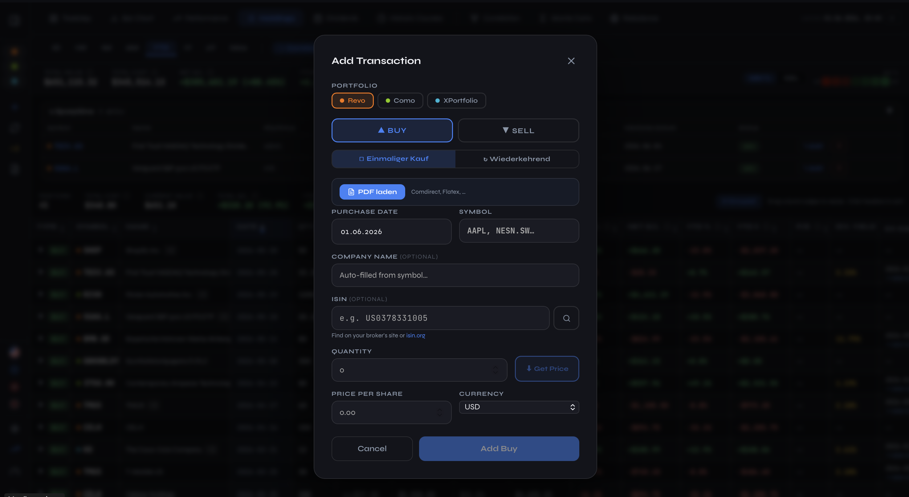
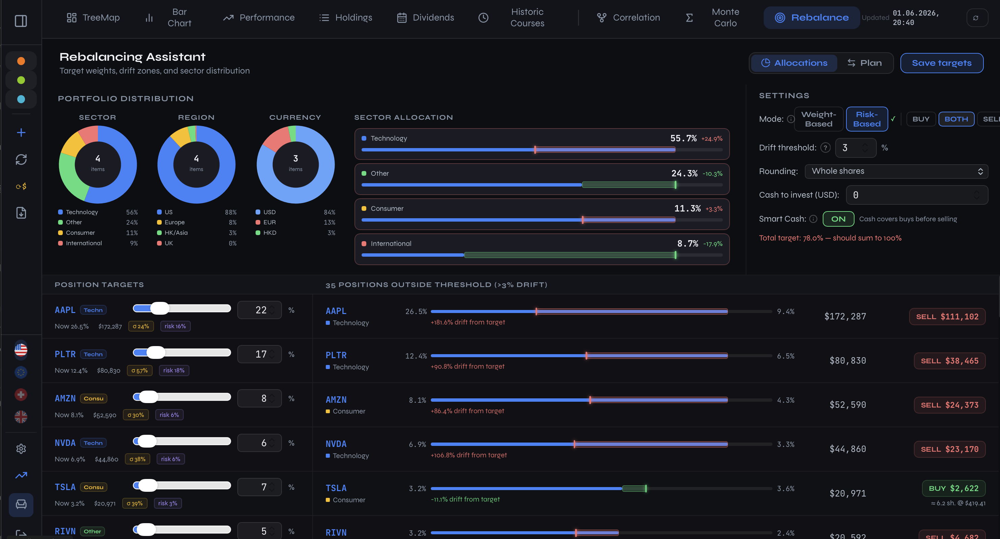

# Portfolio Tracker

A self-hosted, privacy-first portfolio tracker for stocks, ETFs and other securities. Runs as two Docker containers — a Node.js/Express backend with a SQLite database, and a React SPA served by nginx. Designed for Synology NAS but works on any Docker host.

Live quotes via Yahoo Finance (no API key needed). FX rates via Frankfurter API. Optional Alpha Vantage fallback. Full multi-currency support including HKD, CNY, SGD, JPY and more.

---

## Screenshots

### Portfolio Overview — TreeMap
Positions sized by market value, coloured by today's gain/loss or absolute market move. Switch between Consolidated (all portfolios merged) and Aggregated (side-by-side) view.



### Performance Chart
Compare instruments over 1D · 1W · 1M · 6M · YTD · 1Y · 2Y · Max. Three y-axis modes: absolute value, ± dollar delta, ± percent. Intraday view uses minute-level data with exchange-timezone timestamps. BUY/SELL markers sit directly on the line.



### Holdings Table
Full position list with current price, quantity, book value, unrealised P/L, weight, and daily change — sortable by any column.



### Transaction Log
Every buy and sell with original price, quantity, currency and portfolio. Import directly from a broker PDF (Comdirect, Flatex, and others).



### Analytics — Correlation, Monte Carlo, Rebalancing
Correlation heatmap, Monte Carlo simulation and portfolio rebalancing assistant available from the top navigation bar.



> **Adding your own screenshots:** navigate to each view in the browser, press `Cmd/Ctrl+Shift+4` to capture, and save the file into `docs/screenshots/` with the matching filename.

---

## Features

### Portfolio management
- **Multi-portfolio** — any number of named portfolios, each PIN-protected (bcrypt server-side)
- **Multi-currency** — USD, EUR, GBP, CHF, JPY, HKD, CNY, SGD, CAD, AUD, SEK, NOK, DKK — correct FX conversion for all positions
- **Transactions** — BUY and SELL records with quantity, price, date and original currency
- **Savings plans** — recurring buy schedules with budget-per-period
- **Soft-delete** — portfolios can be deleted and restored

### Quotes & data
- **Yahoo Finance proxy** — backed by `yahoo-finance2` v3 with automatic crumb/cookie/session auth; server-side caching with configurable TTL
- **Intraday data** — minute-resolution OHLCV for the current trading day
- **Alpha Vantage fallback** — optional secondary source when Yahoo rate-limits
- **FX rates** — live rates from Frankfurter API (ECB data), cached 60 min; covers all major currencies including Asian pairs
- **Batch quote endpoint** — one round trip for all positions

### Visualisation
- **TreeMap** — position tiles sized by value, coloured by Mkt % change or gain/loss %. Toggle Consolidated vs. Aggregated view across portfolios
- **Bar Chart** — side-by-side value bars with period return overlay
- **Performance chart** — multi-instrument line chart with owned/ghost segments, BUY/SELL markers, and three y-axis modes (Abs / ±$ / ±%)
- **Holdings table** — sortable, with unrealised P/L and weight column
- **Correlation matrix** — Pearson correlation heatmap across selected instruments
- **Monte Carlo simulation** — forward projection with configurable parameters
- **Rebalancing assistant** — target allocation vs. current weight with buy/sell suggestions
- **Dividend calendar** — upcoming and historical dividend events

### Transactions — PDF import
Upload a broker settlement PDF directly in the Add Transaction dialog. The backend extracts text with `pdf-parse` and either:
- Parses it with a **regex fallback** (Comdirect Wertpapierabrechnung format)
- Sends the text to a **configurable AI model** (LM Studio, Ollama, or OpenRouter) for structured extraction from any broker format

Extracted fields (type, date, ISIN, quantity, price, currency) pre-fill the form automatically.

### ISIN → Symbol lookup
Enter an ISIN and click the search button. The backend queries Yahoo Finance and returns up to 10 ticker candidates with exchange, name and current price. If there are multiple matches a pick-list appears; if there is only one it is applied automatically.

### AI model settings
Configure a local or cloud AI model for PDF parsing in the Settings dialog:
- **LM Studio** — local inference server on `localhost:1234`
- **Ollama** — local inference server on `localhost:11434`  
- **OpenRouter** — cloud endpoint with API key
- **Disabled** — regex-only fallback (works for Comdirect PDFs without any AI)

A "Test Connection" button fires a lightweight request to confirm the model is reachable before saving.

---

## Quick start

### Prerequisites
- Docker + Docker Compose
- A Synology NAS (DSM 7+) or any Linux/macOS host

### Run
```bash
git clone https://github.com/Doebele/fintools.git
cd fintools
make build    # builds both containers
make start    # docker-compose up -d
```

Open **`http://localhost:3002`** (or `http://YOUR-NAS-IP:3002`).

Backend health check: `http://localhost:3003/api/health`

### Ports
| Variable | Default | Description |
|---|---|---|
| `FRONTEND_PORT` | 3002 | nginx (React SPA) |
| `BACKEND_PORT` | 3003 | Express API |

Override in `docker-compose.yml` or a `.env` file.

---

## Configuration

All options are environment variables (set in `docker-compose.yml`):

| Variable | Default | Description |
|---|---|---|
| `QUOTE_TTL_MIN` | 5 | Daily quote cache TTL in minutes |
| `FX_TTL_MIN` | 60 | FX rate cache TTL in minutes |
| `RATE_LIMIT_MAX_REQUESTS` | 200 | Express rate limit per IP per 15 min |
| `LOG_LEVEL` | info | `error` / `warn` / `info` / `debug` |
| `AV_API_KEY` | _(empty)_ | Alpha Vantage key for quote fallback |

### Reverse proxy (HTTPS on Synology)
1. Control Panel → Login Portal → Advanced → Reverse Proxy → Create
2. Source: `https://portfolio.your-nas.synology.me` (port 443)
3. Destination: `http://localhost:3002`

---

## Makefile commands

```bash
make build      # docker-compose build --no-cache && up -d
make start      # docker-compose up -d
make stop       # docker-compose down
make restart    # restart containers in place
make logs       # tail logs from both containers
make backup     # SQLite dump → backups/*.db.gz
make restore    # restore newest backup
make stats      # curl /api/stats  (cache hit rate, uptime)
```

**Faster backend iteration** (no full rebuild):
```bash
docker cp backend/server.js portfolio-backend-v3:/app/server.js
docker restart portfolio-backend-v3
```

---

## API reference

### Users & auth
| Method | Endpoint | Description |
|---|---|---|
| GET | `/api/users` | List users |
| POST | `/api/users` | Create user `{username, pin}` |
| POST | `/api/users/login` | Login `{username, pin}` → user + settings |

### Portfolios
| Method | Endpoint | Description |
|---|---|---|
| GET | `/api/portfolios` | List portfolios for user |
| POST | `/api/portfolios` | Create `{name}` |
| DELETE | `/api/portfolios/:id` | Soft-delete |

### Transactions
| Method | Endpoint | Description |
|---|---|---|
| GET | `/api/portfolios/:id/transactions` | List |
| POST | `/api/portfolios/:id/transactions` | Add `{type, symbol, quantity, price, date, currency}` |
| PUT | `/api/transactions/:id` | Update |
| DELETE | `/api/transactions/:id` | Delete |

### Quotes
| Method | Endpoint | Description |
|---|---|---|
| GET | `/api/quotes/yahoo/:symbol` | Raw chart JSON (cached) |
| POST | `/api/quotes/batch` | Batch quotes `{symbols:[]}` |
| GET | `/api/quotes/symbols-for-isin/:isin` | Ticker candidates for ISIN |

### FX
| Method | Endpoint | Description |
|---|---|---|
| GET | `/api/fx/all` | All rates vs USD |
| GET | `/api/fx/:from/:to` | Single pair |

### Tools
| Method | Endpoint | Description |
|---|---|---|
| POST | `/api/tools/parse-pdf` | Extract transaction from broker PDF |
| POST | `/api/tools/test-ai` | Test AI model connectivity |

### System
| Method | Endpoint | Description |
|---|---|---|
| GET | `/api/health` | Health check |
| GET | `/api/stats` | DB stats + cache metrics |

---

## Architecture

```
browser  ──►  :3002  nginx (React SPA)
                │
                └──► proxy /api/ ──►  :3001  Express
                                         │
                                         ├── SQLite  /app/data/portfolio.db
                                         ├── yahoo-finance2 v3  ──► Yahoo Finance
                                         ├── Frankfurter API    ──► ECB FX rates
                                         └── Alpha Vantage      ──► (optional fallback)
```

- **Backend** — single-file `backend/server.js` (~2,400 lines), organised in clearly labelled sections
- **Frontend** — single-file `frontend/src/App.jsx` (~8,200 lines), React 18 with no router, no global state library
- **Database** — SQLite via `better-sqlite3`; schema applied at boot, migrations via conditional `ALTER TABLE`
- **Caching** — in-database quote cache + in-flight request coalescing (`dedupFetch`)

---

## Security

- PINs hashed with bcrypt (cost 10) — never stored in plain text
- Backend container runs as non-root user
- Helmet + rate limiting (200 req / 15 min / IP) on all routes
- PDF parsing runs server-side; uploaded files are never written to disk (memory storage)

---

## Tech stack

| Layer | Technology |
|---|---|
| Runtime | Node.js 18 |
| API | Express 4 |
| Database | SQLite via better-sqlite3 |
| Quotes | yahoo-finance2 v3 |
| FX | Frankfurter API |
| PDF parsing | pdf-parse |
| Frontend | React 18, Vite 5, Recharts, D3, lucide-react |
| Containers | Docker Compose, nginx:alpine + node:18-alpine |

---

**Version:** 3.x · **Updated:** June 2026 · **Built with:** Claude + Claus
